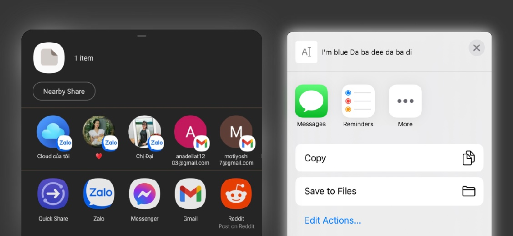

<h1 align="center">
  <br>
  
  <br>
  Godot Share Plugin
  <br>
</h1>

<h4 align="center">Godot plugin to share texts, images or both. Supports Godot 3 & 4</a>.</h4>

<p align="center">
  <a href="https://github.com/kyoz/godot-share/releases">
    
  </a>
  <span>&nbsp</span>
  <a href="https://github.com/kyoz/godot-share/actions">
    
  </a>
  <span>&nbsp</span>
  <a href="https://github.com/kyoz/godot-share/releases">
    
  </a>
  <span>&nbsp</span>
  
  <span>&nbsp</span>
  
</p>

<p align="center">
  <a href="#about">About</a> •
  <a href="#installation">Installation</a> •
  <a href="#usage">Usage</a> •
  <a href="#api">API</a> •
  <a href="#contribute">Contribute</a> •
  <a href="https://github.com/kyoz/godot-share/releases">Downloads</a> 
</p>

<p align="center">
  
</p>

# About

This plugin allows you to share texts, images or both of them (Android/iOS). There is also an advanced method allowing you to save an image to the user's phone.

Built using automation scripts combined with CI/CD to help speed up the release progress as well as the release of hotfixes which save some of our time.

Supports Godot 3 & 4.

# Installation

## Android

Download the [Android plugin](https://github.com/kyoz/godot-share/releases) (match your Godot version), and extract them to `your_project/android/plugins`

Enable `Share` plugin in your android export preset.

*Note*: You must [use custom build](https://docs.godotengine.org/en/stable/tutorials/export/android_custom_build.html) for Android to use plugins.

## iOS

Download the [iOS plugin](https://github.com/kyoz/godot-share/releases) (match your Godot version), and extract them to `ios/plugins`

Enable `Share` plugin in your iOS export preset.

# Usage

An `autoload` script is provided for easier use of this plugin.

Download [autoload file](./autoload) (match your Godot version). Add it to your project `autoload` list.

Then you can easily use the plugin anywhere with:

```gdscript
Share.init()

Share.shareText(title, subject, content)
Share.shareImage(image_path, title, subject, content)

# Godot 3
Share.connect("on_error", self, "_on_error")

# Godot 4
LocalNotification.on_error.connect(_on_error)
```

"Why do I have to call `init()`?"  
Well, if you don't want to, you can change `init()` to `_ready()` in the `autoload` file. But in my experience, when using a lot of plugins, initializing all plugins on `_ready()` is not a good idea. This way, you can choose whenever to initialize the plugin e.g. when showing a loading scene, etc.

For more details, see [examples](./example/)

# API

## Methods

```gdscript
shareText(title, subject, content)
shareImage(image_path, title, subject, content)
shareCapturedScreen(title, subject, content)

# Advanced function, read Caution section below
saveImageToGallery(image_path)
```

**Notes**:

- Title and Subject are based on app support, like Gmail, Youtube, etc. Not every app suports them. You should focus on the content.

- All shared images must be inside your `User Data Folder`. You can easily get that folder path with `OS.get_user_data_dir()`. Make sure to save your images to that folder before sharing, or else this won't work. See [examples](./example/) for more details.

**Caution**:

`saveImageToGallery()` is an advanced feature that I added in case someone needs it. It's great if the player can save ingame images to their phone. But there's something you must do in order to use it, or else it will result in crashing or unwanted behavior.

To use `saveImageToGallery()`:

- Android: Make sure you enabled "Allow Write Permission" in Android's export preset.
- iOS: Add these to your `GameInfo.plist`, feel free to change the message.

```
<key>NSPhotoLibraryAddUsageDescription</key>
<string>To save screen capture image to your gallery</string>
```

And that's all, I've handled the permission request, premission checking process, etc. Call `saveImageToGallery(image_path)` and that's it.

Lastly, I've tried to make the process simple by requesting only neccessary permission(s). This is not a plugin to work with file, so it has some week points.  
For example, on some Android phones, there will be no need to ask for permission, you can save an image directly to `Download`. But when you open Gallery, the image will not be displayed immediately, it will take some moments. You can try to jump between albums until the image appears. (Depending on different Android models, the refresh rate of Gallery varies. Sometimes it's instant, other times not so fast)

## Signals

```gdscript
signal on_error(error_code)  # something's gone wrong, returning error_code
signal on_saved_to_gallery() # emits when `saveImageToGallery()` has completed
```

## Error Codes

> `ERROR_SHARE_CAPTURE_SCREEN`

This rarely happens. Might be because you shared a captured image when the game was on other heavy tasks and couldn't handle this process. 

> `ERROR_SAVE_TO_GALLERY`

Might happen if the image was damaged or user's device has run out of storage.

> `ERROR_IMAGE_FILE`

The shared image was damaged. Rarely happens.

> `ERROR_UNKNOWN`

Unknown error. View Logcat (Android) or XCode debug (iOS) for more information.

# Contribute

I want to help contribute to the Godot community so I create these plugins. I've prepared almost everything to help simplify and speed up the development and release progress.

With only one command, you can build and release this plugin. Read [DEVELOP.md](./DEVELOP.md) for more information.

If you find bugs, please open issues.

If you have time to fix bugs or improve the plugins, please open PR. It's always welcomed and appreciated.

# License

MIT © [Kyoz](mailto:banminkyoz@gmail.com)